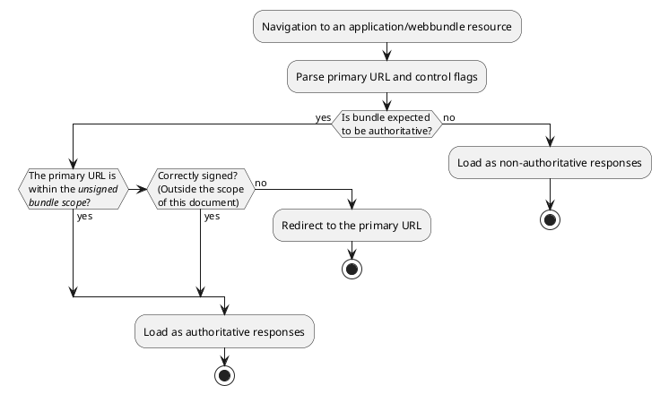

# Explainer: Navigation to Unsigned Web Bundles<br>(a.k.a. Bundled HTTP Exchanges)

Last updated: Apr 07, 2020

Participate at https://github.com/WICG/webpackage and
https://datatracker.ietf.org/wg/wpack/about/.

<!-- TOC depthTo:3 -->

- [Goals](#goals)
- [Proposal](#proposal)
  - [Relevant structure of a bundle](#relevant-structure-of-a-bundle)
  - [Process of loading a bundle](#process-of-loading-a-bundle)
  - [Loading an authoritative unsigned bundle](#loading-an-authoritative-unsigned-bundle)
  - [Loading a non-authoritative bundle](#loading-a-non-authoritative-bundle)
  - [Subsequent loads with an attached bundle](#subsequent-loads-with-an-attached-bundle)
  - [Service Workers](#service-workers)
  - [URLs for bundle components](#urls-for-bundle-components)
  - [Rendering bundle component URLs](#rendering-bundle-component-urls)
- [Open design questions](#open-design-questions)
  - [Do we need an "internal redirect" notion for the bundle->primary-URL redirect?](#do-we-need-an-internal-redirect-notion-for-the-bundle-primary-url-redirect)
  - [Authoritative responses or bundles](#authoritative-responses-or-bundles)
  - [Network access](#network-access)
  - [Non-origin-trusted signatures](#non-origin-trusted-signatures)
- [Anticipated questions](#anticipated-questions)
  - [Why does the distributor control expected authority?](#why-does-the-distributor-control-expected-authority)
- [Security and privacy considerations](#security-and-privacy-considerations)
  - [Potential help to anti-adblock](#potential-help-to-anti-adblock)
  - [Security/Privacy Questionaire](#securityprivacy-questionaire)
- [Considered alternatives](#considered-alternatives)
  - [Alternate formats considered](#alternate-formats-considered)
  - [Alternate URL schemes considered](#alternate-url-schemes-considered)
- [Stakeholder feedback](#stakeholder-feedback)
- [Acknowledgements](#acknowledgements)

<!-- /TOC -->

## Goals

1. Provide a way for users to share web content to other users who may be
   offline when they try to visit the content. This should work with their
   existing file-sharing apps, like [SHAREit](https://www.ushareit.com/),
   [Xender](http://www.xender.com/), or [Google
   Files](https://files.google.com/), which present the unit of sharing as a
   single file.

   <details>
   <summary>

   

   </summary>

   ```plantuml
   @startuml
   cloud Website {
     file page.html
     file image.png
   }
   actor Distributor <<Human>>
   Website --> Distributor : normal browsing
   artifact website.bundle
   Distributor -> website.bundle : bundles
   website.bundle -> Friend
   note top of Friend : No connection\nto the internet!
   @enduml
   ```

   </details>

1. Provide a way for sites like https://www.isocfoundation.org/ to package their
   content so communities can fetch it once over a perhaps-expensive, slow, or
   otherwise sometimes-unavailable link and then share it internally without
   each recipient needing to be online when they get it.

   <details>
   <summary>

   

   </summary>

   ```plantuml
   @startuml
   cloud Website {
     file page.html
     file image.png
     artifact website.bundle
     page.html --> website.bundle
     image.png --> website.bundle
   }
   actor Distributor <<Human>>
   website.bundle -> Distributor : expensive/slow/sometimes-blocked\ninternet connection
   Distributor --> Friend1 : cheap network
   Distributor --> Friend2 : cheap network
   Distributor --> Friend3 : cheap network
   @enduml
   ```

   </details>

1. Provide a way for sites like https://archive.org/ to distribute archived
   content without having to rewrite all its internal links.

   <details>
   <summary>

   

   </summary>

   ```plantuml
   @startuml
   cloud Website1 {
     file page1.html
     file image1.png
   }
   cloud Website2 {
     file page2.html
     file image2.png
   }
   cloud Website3 {
     file page3.html
     file image3.png
   }
   cloud Archive {
     artifact website1.bundle
     page1.html --> website1.bundle
     image1.png --> website1.bundle
     artifact website2.bundle
     page2.html --> website2.bundle
     image2.png --> website2.bundle
     artifact website3.bundle
     page3.html --> website3.bundle
     image3.png --> website3.bundle
   }
   actor User1
   actor User2
   actor User3
   website1.bundle --> User1
   website2.bundle --> User1
   website2.bundle --> User2
   website2.bundle --> User3
   website3.bundle --> User2
   website3.bundle --> User3
   @enduml
   ```

   </details>

See the [Considered alternatives](#considered-alternatives) section for a
description of why the many existing bundling and archiving solutions don't work
well for these use cases.

## Proposal

We propose to use the [Web Bundle
format](https://wicg.github.io/webpackage/draft-yasskin-wpack-bundled-exchanges.html),
without origin-trusted signatures, to give users a format they can create from
any website they're visiting, share it using existing peer-to-peer sharing apps,
and then have a peer load it in their browser. The IETF's [WPACK
WG](https://datatracker.ietf.org/wg/wpack/about/) is chartered to continue
developing this format.

Here's a [demo video](https://youtu.be/xAujz66la3Y) of this use-case for Web
Bundles (a.k.a. Bundled HTTP Exchanges):

<a href="https://www.youtube.com/watch?v=xAujz66la3Y">

</a>

This explainer doesn't currently propose a standard way to identify all the
resources from a loaded web page that need to be included in a bundle, or to
identify a pre-packaged bundle that contains the current page. Instead it
focuses on how to safely load and navigate within a bundle that's already
created.

### Relevant structure of a bundle

A bundle is loaded from a "*bundle URL*", and it contains a set of HTTP *items*,
each with a "*claimed URL*", optional content negotiation information, and an
*HTTP response*. The items are serialized in a particular order within the
bundle, and this will affect the performance of loading the bundle when the
bundle is loaded from a non-random-access medium (like the network), but it
doesn't affect the semantics of the bundle.

<span id="authoritative">Each response might or might not be an [*authoritative
response*](https://httpwg.org/http-core/draft-ietf-httpbis-semantics-latest.html#establishing.authority)</span>
based on considerations below, and we intend the next version of the format to
include a flag stating whether the bundle's distributor ([not necessarily the
original publisher](#why-does-the-distributor-control-expected-authority))
expects the responses to be authoritative.

The bundle URL might be a `file://` URL containing private information like the
user's name, which they might not want exposed to a website they saved for
offline use.

### Process of loading a bundle

When the browser navigates to an `application/webbundle;v=___` resource, or
opens a file that the filesystem identifies as that MIME type, it first parses
the resource enough to pull out the bundle's [primary
URL](https://wicg.github.io/webpackage/draft-yasskin-wpack-bundled-exchanges.html#name-load-a-bundles-metadata)
and an indication of whether the responses in the bundle are expected to be
[authoritiative responses](#authoritative), which for unsigned bundles means the
bundle is served from the origin that its resources claim.

> An origin could use a "non-authoritative" bundle with same-origin resources to
> create a kind of [suborigin](https://w3c.github.io/webappsec-suborigins/).

The diagram below shows how signatures, flags, and primary URL of a WebBundle
determine the mode in which the bundle is loaded.

<details>
<summary>

![When we navigate to a bundle, we parse the primary URL and some control flags
and then follow the following conditional logic. If the bundle is not marked as
expected-to-be-authoritative, its responses aren't treated as authoritative. if
a resource's URL is within the bundle's scope  it's loaded as an authoritative
resource. Determining whether the bundle's resources are correctly signed is
outside the scope of this explainer, but that's another way to have the
resources treated as authoritative. Otherwise it's treated as a redirect to the
claimed
URL.](https://www.plantuml.com/plantuml/svg/XP2nQiCm48PtFyMDpb2qEqC2dGgXBQ7Tl2ZIEHR8Tq9tIfgth-M6KfT2fnFYllyx_hsepLgcs7JFzXBELWCJA8Cbi2d5u9OVSyNJgP2F21c5ItQuRRfNcmKXvJ3PV8Ftus6cF3WcpHnXYFOisoOCq3u9t6dyIEWKVK_AS4AmHKVEGMVB1NSRq149sXlAfW6ewDkuDWJfwHfq35HtmPX24iw4tfYUZBbhn752Otu7OXIieO-SCpgDD_XYTpsrBqKbU9o1EzuJ3p2B13oxCY7fveyuQ8dh6w0xeWyrjjQdwxEtouOefugH3yCykmDR3rRM9TI24vEWL6X1lZq_8M9w-1TSJFjvb2b-0W00)

</summary>



</details>

The following sections describe how bundles are loaded in each mode.

### Loading an authoritative unsigned bundle

The browser selects an **unsigned bundle scope** that's based on the bundle's
URL in the same way the [service worker's scope
restriction](https://w3c.github.io/ServiceWorker/#path-restriction) is based on
the URL of the service worker script. If the bundle is served with the
[`Service-Worker-Allowed`
header](https://w3c.github.io/ServiceWorker/#service-worker-allowed), that sets
the unsigned bundle scope to the value of that header. (We are also considering
using a differently-named header that applies only to bundles.)

> Browsers might also provide a way for device manufacturers to define an area
  of the local filesystem that can serve authoritative unsigned bundles without
  any scope restriction. This would make it easier to pre-install applications
  in a way that has a chance of working across different browsers.

The browser redirects to the bundle's primary URL. If that primary URL is within
the unsigned bundle scope, it also attaches the bundle itself and its unsigned
bundle scope to the redirect and the subsequent environment settings object.
That is, the bundle is treated as just a very expensive redirect if it tries to
claim URL space it's not allowed to define.

Subsequent subresource requests will also only be served from the bundle if
they're inside its scope.

### Loading a non-authoritative bundle

The browser redirects to [a URL that refers to the bundle's primary URL *inside
its bundle*](#urls-for-bundle-components), with the bundle itself attached.

Because the user might save a bundle to a file whose path includes private
information like their username, APIs like
[`Window.location`](https://developer.mozilla.org/en-US/docs/Web/API/Window/location)
and
[`Document.URL`](https://developer.mozilla.org/en-US/docs/Web/API/Document/URL)
have to return the claimed URL and not the full encoded URL. Avoiding the new
scheme in these APIs will also probably improve compatibility.

### Subsequent loads with an attached bundle

The bundle that's attached to the request above will eventually get attached to
the environment settings object created for the response, from where subsequent
fetches can use it.

All fetches, both navigations and subresources, check inside the bundle before
going to the network and keep propagating the bundle to new environment settings
objects. For authoritative bundles, the logic above for redirecting to the
network still applies if a contained resource is outside the authoritative
scope. For non-authoritative bundles, [we're not sure if subresource requests
should be able to touch the network at all.](#network-access)

### Service Workers

We plan to, but haven't yet, defined an API to expose
[authoritative](#authoritative) resources within bundles to that origin's
service worker. This API should allow the service worker to fill its cache with
the contents of the bundle.

### URLs for bundle components

Each item of the bundle is addressible using a URL, with the new scheme
`package:`. (See [below](#alternate-URL-schemes-considered) for some details of
this choice.) This scheme identifies both the URL of the bundle itself (e.g.
`https://distributor.example/package.wbn?q=query`) and the claimed URL inside
the bundle (e.g. `https://publisher.example/page.html?q=query`). These are
encoded to minimize the changes needed to the [algorithm for computing an origin
from a URL](https://url.spec.whatwg.org/#concept-url-origin), by replacing `:`
with `!`, `/` with `,`, and `?` with `;`, and separating the 2 URLs with `$`.
Any instance of `!`, `,`, `;`, or `$` in the URLs themselves is %-encoded:

```url
package://https!,,distributor.example,package.wbn;q=query$https!,,publisher.example/page.html?q=query
```

The origin for that URL is:

```url
package://https!,,distributor.example,package.wbn;q=query$https!,,publisher.example
```

These URLs and origins allow the components of bundles to save data in a way
that's shared within the same claimed origin within a single bundle, but which
can't conflict with or attack:

* sites served verifiably from that claimed origin (e.g.
  `https://publisher.example/page.html?q=query`),
* other bundles (e.g. `package://https!,,distributor.example,otherpackage.wbn;q=query$https!,,publisher.example/page.html?q=query`), or
* other origins within the same bundle (e.g. `package://https!,,distributor.example,package.wbn;q=query$https!,,otherpublisher.example/page.html?q=query`).

### Rendering bundle component URLs

Since it's a new scheme, we have to think about how browsers should render
`package:` URLs. The current [rendering advice in the URL
spec](https://url.spec.whatwg.org/#url-rendering) is probably not appropriate
for the default display of `package:` URLs, as users won't understand the
significance of its "host" part,
`https:,,distributor.example,otherpackage.wbn;q=query$https:,,publisher.example`.

We suggest that, in places the browser would render just a URL's host, it render
the host of the *bundle's* URL, so just `distributor.example` in the above
example. When the browser would render the full URL, it should show just the
bundle's URL with some indication that it's viewing just a piece of that bundle.
To edit the URL, the browser should allow the user to pick from the resources
contained inside the bundle instead of encouraging the user to edit the text of
the `package:` URL.

## Open design questions

### Do we need an "internal redirect" notion for the bundle->primary-URL redirect?

See also [whatwg/fetch#576](https://github.com/whatwg/fetch/issues/576).

### Authoritative responses or bundles

Should we mark entire bundles as authoritative vs non-authoritative or make it
possible to mark the individual resources differently within the same bundle?

It seems simpler to mark the bundle as a whole, and there might be footguns in
letting people mark different resources differently, but ultimately HTTP relies
on describing each response, so we could allow them to be different.

### Network access

Should non-authoritative bundles be able to go to the network at all? Should
users be able to explicitly grant permission?

Under repressive governments, non-authoritative bundles may be a good way for
dissidents to share information, but if the government can add their own
tracking code to the bundles, they may be able to catch people using the banned
information.

However, there are also use cases like for sharing book previews, where a
publisher might want to provide both a free preview and the encrypted rest of
the book in the same unsigned bundle, while letting users buy a small decryption
key with an online flow. On the other hand, perhaps that use case should use the
signed bundles that aren't being proposed in this explainer.

### Non-origin-trusted signatures

While this explainer doesn't propose any particular ways to use any signatures
in the bundle, there are several options:

* Support [signature-based SRI](https://github.com/mikewest/signature-based-sri).
* Display a real-world publisher for the content, which is especially useful for
  books.
* Allow the application to [pin updates to a particular signing
  key](https://wicg.github.io/webpackage/draft-yasskin-wpack-use-cases.html#name-protecting-users-from-a-com).
  (Which has risks.)
* Grant access to some particularly-powerful API because the signature vouches
  that a trusted auditor checked the package for malicious behavior.

## Anticipated questions

### Why does the distributor control expected authority?

The distributor, rather than the publisher, defines whether responses in a
bundle are expected to be [authoritative](#authoritative) because we can't stop
them and because it doesn't give them any extra power.

There are 3 cases:

1. **The resource is authoritative:** For an unsigned bundle to be
   authoritative, the publisher has to be the distributor. We're not dealing
   with signed bundles in this explainer.
1. **The resource is not authoritative:**
   1. **The publisher marked the resources as expected-to-be-authoritative, but
      the distributor changed that to expected-to-not-be-authoritative:**

      Without encryption, the distributor could build an entrely new bundle with
      the same content

   1. **The publisher marked the resources as expected-to-not-be-authoritative,
      but the distributor changed that to expected-to-be-authoritative:**

      This causes a redirect to the claimed URL. Since the resource isn't
      authoritative, the distributor could have rewritten the resource itself
      into a redirect, accomplishing the same effect.

## Security and privacy considerations

* Unsigned bundles served by one origin can't be trusted to provide content for
  another origin. The [URL design](#urls-for-bundle-components) and the division
  between authoritative and non-authoritative bundles are designed to keep
  separate origins safely separate, but this is more than a trivial amount of
  complexity, and browsers will need to be careful to actually enforce the
  boundaries.

* It's straightforward for someone serving an unsigned bundle to include a
  unique ID in the resources within that bundle. If the bundle can then make
  [network requests](#network-access), the author can determine a rough number
  and set of IP addresses who received a copy of the same download. If the
  author can additionally convince the user to log in or enter other identifying
  information, they can identify the set of users who are connected. This is
  detectable if users have a way to inspect two bundles that are supposed to
  hold the same content, but since the whole point of sharing bundles is to
  reduce redundant transfers, it's unlikely many users  will actually check
  this.

  Sites currently gather information on this kind of link sharing by annotating
  their URLs with unique or semi-unique IDs. These can usually be removed by
  removing query parameters, but if a significant number of users cleaned their
  URLs, the tracking could move to path segments.

* The path of a locally-saved bundle may include private information like a
  username. As [Loading a non-authoritative
  bundle](#loading-a-non-authoritative-bundle) suggests, the URL of the bundle
  itself needs to be hidden from web APIs to avoid exposing this.

### Potential help to anti-adblock

By providing a standard format to represent a whole website, these bundles might
make it easier for advertising networks to disguise their resources from
url-based ad blockers that take input like
https://easylist.to/easylist/easylist.txt.

To make it impossible to add a URL-based rule to block an ad, all of the URLs
used to load the ad's content need to be indistinguishable from the URLs used
for wanted content. That's difficult for an ad network in general because they
value being able to update the code that renders ads and to select the ads
themselves in real time. This leads most to work by having publishers add a
static piece of HTML to their site, like (from
https://support.google.com/adsense/answer/7584263 and
https://support.google.com/admanager/answer/1638622)

```html
<script data-ad-client="ca-pub-1234567890123456" async
  src="https://pagead2.googlesyndication.com/pagead/js/adsbygoogle.js"></script>
<script async="async"
  src="https://securepubads.g.doubleclick.net/tag/js/gpt.js"></script>
```

This link out to some dynamic online resource acts as a drag on the ad network's
ability to avoid EasyList blocks. To avoid the online request, the ad network
needs to be able to transform the publisher's HTML as often as they want to
change their code or ad choice. Today, they could do this by giving the
publisher some code to integrate into the publisher's site-building software
that would pull down the latest ad network code and serve it from an obfuscated
URL. This could be especially easy for a publisher whose site is based on
Wordpress, since it takes plugins in a common format and constitutes a large
proportion of all sites.

With bundles, they could instead have publishers publish their pages to bundles
and let the ad network transform the bundles to embed ads before the publisher
serves them. If bundles become very widely used, that might reduce the ad
network's maintenance burden. Even then, the publisher would still need to be
able to generate their sites dynamically in order to let ad networks select ads.

It seems unlikely that ad networks will abandon their ability to dynamically
choose ads, even in order to avoid ad blockers, and if they wanted to do so,
they could do it without bundles for a significant fraction of sites.

Non-advertising scripts that "ad" blockers want to block have an easier job
today, meaning web packaging helps them less.
https://github.com/Valve/fingerprintjs#manual-minification already describes how
to disguise the names in a fingerprinting script and inline it into, for
example, a [rollup.js](https://rollupjs.org/) bundle.

### Security/Privacy Questionaire

This section contains answers to the [W3C TAG Security and Privacy
Questionnaire](https://w3ctag.github.io/security-questionnaire/).

#### 1. What information might this feature expose to Web sites or other parties, and for what purposes is that exposure necessary?

If we allow [network access](#network-access) from non-authoritative bundles,
they could be abused to [identify the set of people who have copies of the same
download](#security-and-privacy-considerations).

We're blocking access to the `package:` URL because for local bundles that would
include the path of the bundle.

#### 2. Is this specification exposing the minimum amount of information necessary to power the feature?

Yes.

#### 3. How does this specification deal with personal information or personally-identifiable information or information derived thereof?

This feature blocks access to local paths, which might otherwise be exposed by the `package:` scheme.

#### 4. How does this specification deal with sensitive information?

See #3.

#### 5. Does this specification introduce a new state for an origin that persists across browsing sessions?

This proposal introduces a new kind of origin with state that persists across
browsing sessions. Specifically, the [`package:`
scheme](#urls-for-bundle-components) defines an origin based on the location or
the URL of the bundle itself, and the claimed URL inside the bundle.

#### 6. What information from the underlying platform, e.g. configuration data, is exposed by this specification to an origin?

None.

#### 7. Does this specification allow an origin access to sensors on a user’s device

No.

#### 8. What data does this specification expose to an origin? Please also document what data is identical to data exposed by other features, in the same or different contexts.

Network requests (e.g. fetch or iframe) from the unsigned bundle could expose IP
address of the user, in the same way as regular navigation does.  See also this
[section](#network-access) about how network requests from non-authoritative bundles
should be performed or not.

Navigation and subresource requests within the [unsigned bundle
scope](#loading-an-authoritative-unsigned-bundle) of an authoritative bundle should
expose strictly less information than loading each contained resource directly
from the server, since it stops exposing the time that resource was needed.

#### 9. Does this specification enable new script execution/loading mechanisms?

No.

#### 10. Does this specification allow an origin to access other devices?

No.

#### 11. Does this specification allow an origin some measure of control over a user agent’s native UI?

No.

#### 12. What temporary identifiers might this specification create or expose to the web?

This explainer avoids exposing the [new URL scheme for non-authoritative
bundles](#urls-for-bundle-components) to the web, as the bundle URL piece of the
authority can include private information including identifiers.

#### 13. How does this specification distinguish between behavior in first-party and third-party contexts?

For navigation, this specification itself doesn’t distinguish between behavior
in first-party (i.e. top-level navigation) and third-party (i.e. iframe or
nested navigation) and doesn't affect other constraints on navigations.

A first-party bundle (that is, one whose claimed URLs are same-origin with the
bundle itself) can provide [authoritative responses](#authoritative), while a
third-party one must not (as this explainer doesn't cover signed bundles).

For subsequent subresource loading with an attached bundle, again there is no
particular difference from regular subresource loading, and origins between
different claimed URLs for each resource is distinguished as different
third-party origins.

#### 14. How does this specification work in the context of a user agent’s Private Browsing or "incognito" mode?

This specification doesn't interact with Private Browsing, although it would be
plausible to make Private Browsing affect the default state of the [Network
access](#network-access) open design question.

#### 15. Does this specification have a "Security Considerations" and "Privacy Considerations" section?

See the [security considerations in the format
specification](https://wicg.github.io/webpackage/draft-yasskin-wpack-bundled-exchanges.html#security),
[security and privacy considerations in this
explainer](#security-and-privacy-considerations), and the [open design questions
in this explainer](#open-design-questions).

#### 16. Does this specification allow downgrading default security characteristics?

Similarly to Service Workers, this specification allows a resource fetched from
one path to provide responses for another path within the same origin. For
Service Workers, that's the Service Worker script itself; here it's the Web
Bundle. Both are [constrained by default](#loading-an-authoritative-unsigned-bundle) to
only override the subtree of paths rooted at their own directory, and someone
with control of the server's response headers can loosen the constraint using
the `Service-Worker-Allowed` response header (or possibly a differently-named
header for bundles).

#### 17. What should this questionnaire have asked?

## Considered alternatives

### Alternate formats considered

There are several existing ways to serialize a web page or website, but all of
them have shortcomings for the use cases we're focusing on:

#### Save as directory tree

This is currently supported by Chromium and Firefox using the `Save As...` |
`Webpage, Complete` dialog. The result is a whole directory, which doesn't match
the sharing models of the existing apps.

#### Save as MHTML

This is currently supported by Chromium using the `Save As...` | `Webpage,
Single File` dialog.

MHTML isn't a random-access format, which means that the entire prefix of the
file needs to be parsed to get to any particular resource. This probably
wouldn't be an issue for single web pages, but for full websites or bundles of
multiple websites, it can be slow.

MHTML would need an extension to support content negotiation between multiple
representations at the same URL.

Although this wouldn't be a good reason to avoid MHTML on its own, we can do
better nowadays than a text format with boundary strings.

#### Save as Web Archive

This is currently supported by Safari using the `Save As...` | `Web Archive` dialog.

A Web Archive is in the semi-documented binary plist format and doesn't support
random access or content negotiation either. Web Archives also currently allow
[UXSS](https://blog.rapid7.com/2013/04/25/abusing-safaris-webarchive-file-format/)
if a user opens one from an untrustworthy source.

#### WARC

[WARC](https://en.wikipedia.org/wiki/Web_ARChive) was designed for archiving
websites and is in active use by the [Internet Archive](https://archive.org/)
and many other web archives. It includes more information about the archival
process itself than MHTML does. Most of this extra information would probably be
irrelevant to the use cases in this document, although the archival timestamp
could be useful.

Like MHTML, WARC is not random access.

#### Mozilla Archive Format

"The [MAFF](http://maf.mozdev.org/maff-specification.html) format is designed to
work in the same way as when a saved page is opened directly from a local file
system", which means that response headers can't be encoded at all. MAFF also
doesn't pick one of its contained pages as the default one, so there's nothing
to navigate to if a user just opens the MAFF as a whole.

As a ZIP file, each of the subresources of one of the contained pages can be
accessed randomly, but MAFF doesn't appear to define any way for the pages to
link to each other.

#### A bespoke ZIP format

ZIP is nicely random access if we encode the resource URL into the path.
However, URLs aren't quite paths, so we would probably need to encode them.

ZIP holds files, so we would need to encode any content negotiation information and response headers into the stored files.

The ZIP format has some ambiguities in parsing it that have led to
[vulnerabilities in
Android](https://nakedsecurity.sophos.com/2013/07/10/anatomy-of-a-security-hole-googles-android-master-key-debacle-explained/).

ZIP files place their index at the end, which allows them to be generated
incrementally or updated by simply appending new data. However, the trailing
authoritative index prevents a consumer from processing anything until the
complete file is received. Streaming isn't particularly useful for the
peer-to-peer transfer use case, but it allows the same format to be used for
subresource bundles (which will have a separate explainer).

### Alternate URL schemes considered

A Google doc, [Origins for Resources in Unsigned
Packages](https://docs.google.com/document/d/1BYQEi8xkXDAg9lxm3PaoMzEutuQAZi1r8Y0pLaFJQoo/edit),
goes into more detail about why we need a new scheme at all, and discusses the
2-URL scheme described above and a hash+URL scheme similar to [`arcp://ni,`
URIs](https://tools.ietf.org/html/draft-soilandreyes-arcp-03#section-4.1).

#### arcp

[draft-soilandreyes-arcp](https://tools.ietf.org/html/draft-soilandreyes-arcp-03),
from 2018, proposes an `arcp:` scheme that encodes a UUID, hash, or name for an
archive/package, plus a path within that package. It's designed to be usable
with several different kinds of archive, listing "application/zip",
"application/x-7z-compressed", LDP Containers, installed Web Apps, and a BagIt
folder structure as possible kinds.

By using just a path to identify the thing within the package, `arcp:` isn't
compatible with the way bundles include resources from several different
origins. On the other hand, the [`package:` scheme](#urls-for-bundle-components)
discussed above can work for path-based archives, by either using a `file:` URL
to identify the element of the package, or perhaps by omitting the part of the
authority after `$`. Adding a second URL may also be a compatible addition to
`arcp:`.

`arcp:` doesn't define a way to locate the archive, which prevents an external
link from pointing directly to one element of the archive, but an external link
can still point to the archive as a whole. Once a client has seen an archive, it
can store a mapping from any of the `arcp:` URI forms to the archive itself,
which allows navigation within the archive. The `arcp://ni,` form, in
particular, has the benefit of allowing users to move an archive around without
losing its storage; and the drawback of preventing the user from upgrading the
archive without losing its storage.

`arcp:`'s flexibility in naming the archive, between random UUIDs, UUIDs based
on the archive's location, hashes of the archive content, or system-dependent
archive names, could be useful for varying system requirements, but it also
introduces implementation complexity. We'd probably want to pick just one of those options for bundles.

#### pack

[draft-shur-pack-uri-scheme](https://tools.ietf.org/html/draft-shur-pack-uri-scheme-05),
from 2009, defines a `pack:` scheme meant for use with OOXML packages. It
identifies a package with an encoded URL, which partially inspired the
[encoding](#urls-for-bundle-components) proposed in this document. Like `arcp:`
it only expects elements of a package to have paths, which doesn't allow the
full URLs needed by web bundles.

## Stakeholder feedback

* W3CTAG: ?
* Browsers:
  * Safari: ?
  * Firefox: [In progress](https://github.com/mozilla/standards-positions/issues/264)
  * Samsung: ?
  * UC: ?
  * Opera: ?
  * Edge: ?
* Web developers: ?

## Acknowledgements

Many people have helped in the design of web packaging in general. The design of
the URL scheme was helped in particular by:

* Anne van Kesteren
* Graham Klyne and the uri-review@ietf.org list
